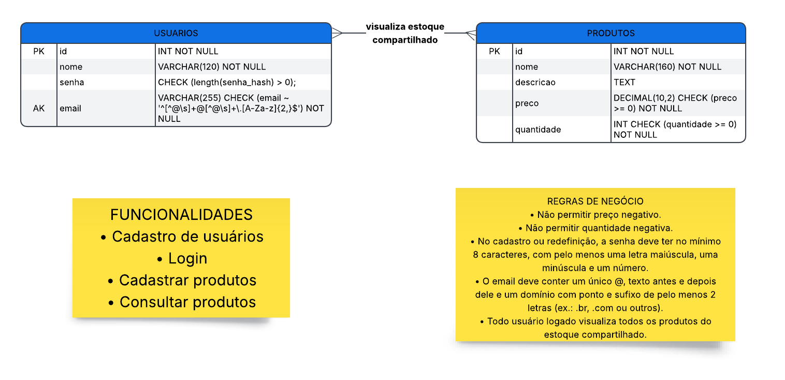

# Documentação do Banco de Dados – Estoque

## Modelo Entidade-Relacionamento (MER)

## Regras de Negócio

### RN01 — Unicidade de E-mail

* **Descrição:** Garantir que cada conta de usuário registrada no sistema possua um identificador de e-mail exclusivo.
* **Especificações Técnicas / Critérios de Aceite:**

  * **Banco de Dados:** A coluna `email` na tabela de usuários deve possuir a restrição `UNIQUE` e não aceitar valores nulos (`NOT NULL`).
  * **Tratamento no Cadastro/Edição:** A aplicação deve normalizar o e-mail (converter todas as letras para minúsculas e remover espaços extras) antes da verificação e persistência.
  * **Validação de Formato:** O campo deve ser validado via Expressão Regular (Regex) compatível com o padrão RFC 5322 antes de tentar a inserção na base de dados.
  * **Mensagem de Erro:** Caso ocorra uma tentativa de cadastro com e-mail já existente, o sistema deve retornar o código HTTP `409 Conflict` com a mensagem *"O e-mail informado já está em uso"*.

### RN02 — Proteção e Criptografia de Senhas

* **Descrição:** Assegurar a privacidade e a segurança dos dados de acesso dos usuários, impedindo o armazenamento de senhas em texto plano.
* **Especificações Técnicas / Critérios de Aceite:**

  * **Algoritmo de Hashing:** A senha em texto puro jamais deve ser gravada no banco ou enviada em logs. Deve ser processada utilizando um algoritmo de hash adaptativo e seguro (utilizaremos o `bcrypt`).
  * **Salting:** O hash deve incorporar um *salt* gerado aleatoriamente e de forma única para cada usuário.
  * **Política de Complexidade:** O campo de senha deve exigir no mínimo 8 caracteres, contendo pelo menos uma letra maiúscula, uma minúscula e um número no momento do cadastro ou redefinição.

### RN03 — Autenticação de Usuário

* **Descrição:** Validar as credenciais fornecidas pelo usuário para conceder acesso aos recursos protegidos do sistema.
* **Especificações Técnicas / Critérios de Aceite:**

  * **Verificação de Credenciais:** A aplicação deve comparar a senha informada com o hash armazenado na base de dados utilizando a função de comparação segura do algoritmo de hash (à prova de *timing attacks*).
  * **Tratamento de Erro Seguro:** Caso a combinação de e-mail e senha seja inválida, o sistema deve retornar o código HTTP `401 Unauthorized` com a mensagem genérica *"E-mail ou senha incorretos"*, sem indicar qual dos dois campos falhou.

### RN04 — Unicidade e Visibilidade do Estoque Global

* **Descrição:** Manter uma base centralizada de estoque para todos os produtos comercializados ou gerenciados pela aplicação.
* **Especificações Técnicas / Critérios de Aceite:**

  * **Modelagem:** Os produtos e suas respectivas quantidades pertencem a uma única entidade de estoque central no banco de dados, sem separação física ou lógica por filiais ou depósitos regionais.
  * **Concorrência:** Operações de atualização do estoque devem utilizar transações de banco de dados (ACID) com controle de concorrência (ex.: *Pessimistic Lock* ou *Optimistic Lock*) para evitar inconsistências (*race conditions*) em vendas/alterações simultâneas.

### RN05 — Autorização para Cadastro de Produtos

* **Descrição:** Permitir a inclusão de novos itens no catálogo por qualquer usuário que esteja autenticado no sistema.
* **Especificações Técnicas / Critérios de Aceite:**

  * **Validação de Permissão:** O sistema deve checar apenas se a sessão/token do usuário é válida (usuário autenticado), sem exigir perfil específico de administrador nesta etapa.

### RN06 — Autorização para Consulta de Produtos

* **Descrição:** Garantir acesso total ao catálogo de produtos para qualquer usuário com sessão ativa no sistema.
* **Especificações Técnicas / Critérios de Aceite:**

  * **Escopo de Leitura:** Usuários autenticados têm permissão para listar todos os produtos ativos e visualizar os detalhes individuais de cada item.
  * **Paginação:** Para otimizar a performance do banco de dados, os endpoints de listagem devem aceitar e aplicar parâmetros de paginação padrão (ex.: `page`, `limit`, com valor máximo padrão de 100 itens por consulta).
  * **Status HTTP:** Consultas bem-sucedidas retornam código `200 OK`.

### RN07 — Integridade da Quantidade em Estoque

* **Descrição:** Impedir o registro de saldos negativos de produtos no banco de dados.
* **Especificações Técnicas / Critérios de Aceite:**

  * **Restrição na Base de Dados:** O campo `quantidade` da tabela de produtos deve possuir uma restrição de verificação no banco de dados (`CHECK (quantidade >= 0)`).
  * **Tipagem:** O atributo deve ser mapeado como um tipo numérico inteiro (`INTEGER` ou equivalente sem sinal).
  * **Validação de Saída/Baixa:** A camada de aplicação deve validar se a quantidade a ser deduzida é menor ou igual à quantidade atual em estoque antes de autorizar uma movimentação. Caso a quantidade final resulte em valor menor que zero, a operação deve ser abortada retornando HTTP `400 Bad Request` com a mensagem *"Quantidade em estoque insuficiente"*.

### RN08 — Integridade do Preço do Produto

* **Descrição:** Garantir que os valores monetários atribuídos aos produtos sejam sempre não negativos.
* **Especificações Técnicas / Critérios de Aceite:**

  * **Restrição na Base de Dados:** A coluna `preco` deve ser definida com tipo de dado numérico de precisão fixa (ex.: `DECIMAL(10,2)`) e possuir restrição de checagem (`CHECK (preco >= 0.00)`).
  * **Validação na Aplicação:** O valor fornecido no cadastro ou atualização de preço deve ser estritamente maior ou igual a zero.
